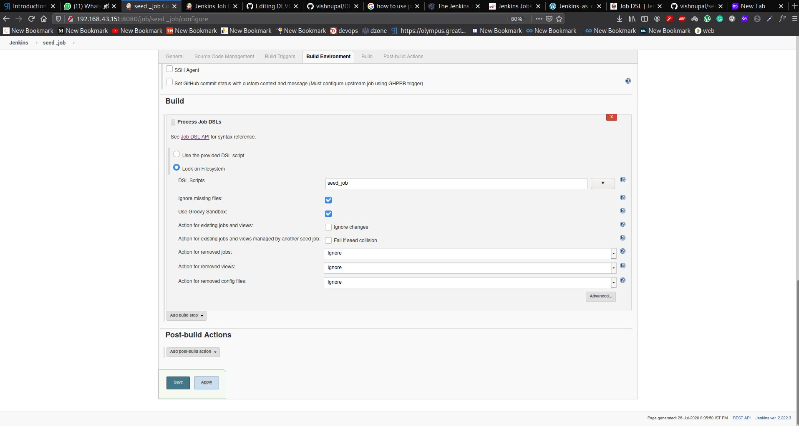

# DEVOPS-TASK-6
 
## In this task i use  DSL is scriptable via Groovy and so it is extremely flexible. The DSL also provides direct control over a job’s XML.
### here i use job DSL plugin for automate the task you can use the pipeline for single mangement but job plugin is help to create different jobs and manage that job is very esay rather then pipeline 
## job DSL It allowed you to introduce logic and variables into scripting your Jenkins jobs and typically one would use these jobs to form some sort of "pipeline" for a particular project. This plugin received quite a bit of traction as a common way to enable job templating and scripting.
## Jenkins Pipeline (2.0) is a new incarnation of a Jenkins job that is entirely based on a DSL and attempts to eliminate the need to stitch together multiple jobs to fill a single pipeline which was by far the most common use of Job DSL. Originally, with Pipeline DSL not offering many of the features that Job DSL did, and as mentioned above Job DSL would allow you to create Pipeline jobs, they could be used together to define a pipeline
## So perform the Job DSl we need a seed job but in pipeline we not need of seed job 
## What is seed job The seed job is a Jenkins job which runs a DSL scripts, and then generates a new job. The seed job is a normal free-style Jenkins job that you add the “Process Job DSL” build step. This step takes the DSL and generates the configured jobs.

# TASK DESCRIPTION
## Create container image that’s has Jenkins installed  using dockerfile  Or You can use the Jenkins Server on RHEL 8/7
### So here i use my own system for jenkins server.

## Create a job chain of job1, job2, job3 and  job4 using build pipeline plugin in Jenkins 
## Job2 ( Seed Job ) : Pull  the Github repo automatically when some developers push repo to Github.

## Further on jobs should be pipeline using written code  using Groovy language by the developer

  ###  1. By looking at the code or program file, Jenkins should automatically start the respective language interpreter installed image container to deploy code on top of Kubernetes ( eg. If code is of  PHP, then Jenkins should start the container that has PHP already installed ) Expose your pod so that testing team could perform the testing on the pod
  ## Make the data to remain persistent using PVC ( If server collects some data like logs, other user information )
## Job3 : Test your app if it  is working or not.
## Job4 : if app is not working , then send email to developer with error messages and redeploy the application after code is being edited by the developer
```
job("github_pull")
{
  scm{
    
    github("vishnupal/DEVOPS-TASK-6")
    
  }
  
  triggers{
        
       authenticationToken('git_commit')
    
        githubPush()
  
}
  
  steps{
    
      shell("sudo cp -rvf * /storage")   
    if(shell("sudo ls /storage/ | grep html ")) {
      dockerBuilderPublisher {
            dockerFileDirectory("/storage/")            
            cloud("docker")
        tagsString("9057508163/html:v1")
            pushOnSuccess(true)
      
            fromRegistry {
                  url("9057508163")
                  credentialsId("xxxxxxxx-xxxx-xxxx-xxxx-xxxxxxxxxxxx")
            }
            pushCredentialsId("xxxxxxxx-xxxx-xxxx-xxxx-xxxxxxxxxxxx")
            cleanImages(false)

            cleanupWithJenkinsJobDelete(false)
            noCache(false)
            pull(true)
           
      }
}else {
      dockerBuilderPublisher {
            dockerFileDirectory("/storage/")            
        cloud("docker")
        tagsString("9057508163/php:v1")
            pushOnSuccess(true)
      
            fromRegistry {
                  url("9057508163")
                  credentialsId("xxxxxxxx-xxxx-xxxx-xxxx-xxxxxxxxxxxx")
            }
            pushCredentialsId("xxxxxxxx-xxxx-xxxx-xxxx-xxxxxxxxxxxx")
                cleanImages(false)

            cleanupWithJenkinsJobDelete(false)
            noCache(false)
            pull(true)
}
 }
}
}
job("detect_DSL"){
  
   triggers {
        upstream('github_pull', 'SUCCESS')
    }
  
  steps{
    
    shell("if sudo ls /storage/ | grep html;then  sudo curl -u admin:redhat http://192.168.43.151:8080/job/html_dep_DSL/build?token=html_dep;   else  sudo  curl -u admin:redhat http://192.168.43.151:8080/job/php_dep_DSL/build?token=php_dep;fi;")
}
}

job("html_dep_DSL")
{
  
  triggers{
    authenticationToken('html_dep')
    upstream('detect_DSL','SUCCESS')
    
  }
  
  steps{
    shell("if sudo kubectl get pvc | grep html;then if sudo  kubectl get deploy | grep html; then  sudo kubectl set image deploy/html-app html-con=9057508163/html:v1;  else sudo kubectl create -f /storage/create_html_deploy.yml;fi;else sudo kubectl create -f /storage/create_html_deploy.yml;fi;")
  }
}


job("php_dep_DSL")
{
  
  triggers{
    authenticationToken('php_dep')
   
    upstream('detect_DSL','SUCCESS')
    
  }
  
  steps{
    shell("if sudo kubectl get pvc | grep php;then if sudo kubectl get deploy | grep php; then  sudo  kubectl set image deploy/html-app html-con=90575081630/php:v1;  else sudo kubectl create -f /storage/create_html_deploy.yml;fi;else sudo kubectl create -f /storage/create_php_deploy.yml;fi;")
  }
}

job("test_DSL") {
   triggers{
    
    upstream("php_dep_DSL,html_dep_DSL")
   }
steps {
    
    shell('export status=$(curl -siw "%{http_code}" -o /dev/null 192.168.43.151:32000); if [ $status -eq 200 ]; then exit 0; else python3 /storage/mail.py; exit 1; fi')  }
}
```
